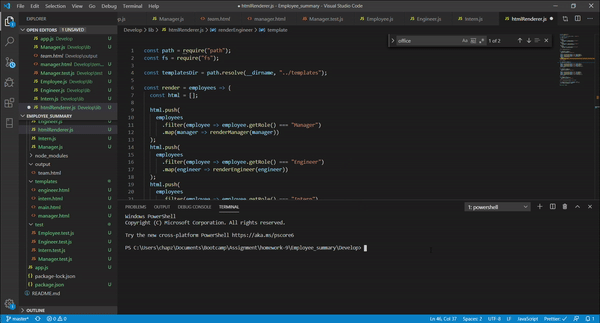
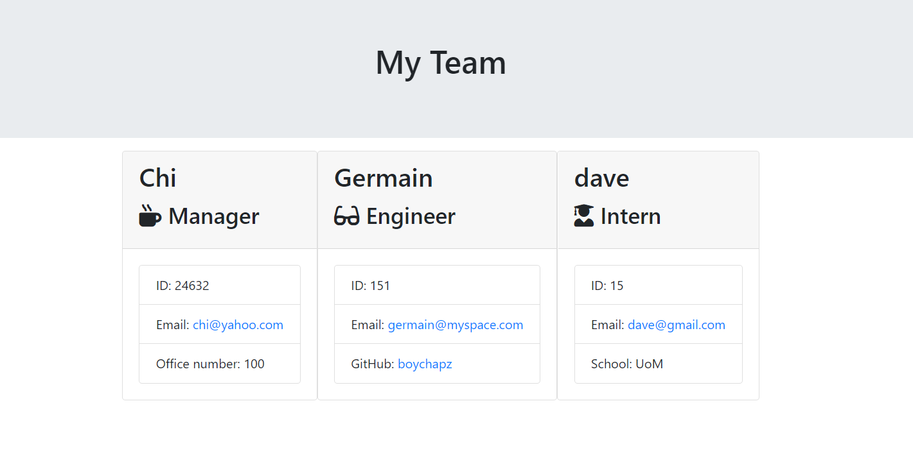

# Employee_summary

User Story
As a manager I want to generate a webpage that displays my team's basic info so that I have quick access to emails and GitHub profiles

# Minimum Requirements for app Functional application.

GitHub repository with a unique name and a README describing the project.

User can use the CLI to generate an HTML page that displays information about their team.

All tests must pass.

# summary

# Screenshot

